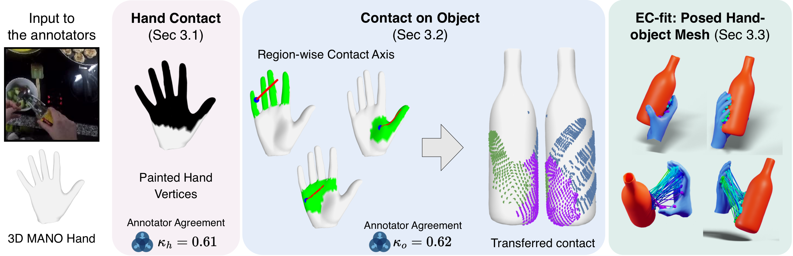

# The Official Code Repository for EC-fit

EC-fit is an optimisation-based fitting pipeline that generates 3D hand-object posed meshes from an RGB image and hand-object contact annotations.

> Please check the paper for more details:  
> [**Towards in-the-wild Egocentric 3D Hand-Object Pose Estimation**](https://sid2697.github.io/epic-contact/)  
> Siddhant Bansal<sup>1</sup>, Zhifan Zhu<sup>1</sup>, Shashank Tripathi<sup>2</sup>, Jiahe Zhao<sup>1</sup>, Michael J. Black<sup>2</sup>, Dima Damen<sup>1</sup>  
> <sup>1</sup>University of Bristol, <sup>2</sup>Max Planck Institute for Intelligent Systems, Tübingen  
> *European Conference on Computer Vision (ECCV), 2026*  
> [Project Page](https://sid2697.github.io/epic-contact/) · [Download EPIC-Contact Dataset](https://huggingface.co/datasets/Sid2697/epic-contact) · [Models](https://huggingface.co/Sid2697/HOPformer) · [EC-fit](https://github.com/ZJHTerry18/ec-fit)



## Environment Setup

1. Clone repository and create conda environment:
```shell
git clone https://github.com/ZJHTerry18/ec-fit.git
conda create -n ecfit python=3.10
conda activate ecfit
```

2. Install pytorch: ```pip install torch==2.4.1 torchvision==0.19.1 torchaudio==2.4.1 --index-url https://download.pytorch.org/whl/cu124```

3. Install necessary requirements: ```pip install -r requirements.txt```

4. Install the SDF-based collision loss library from source:
  - based on https://github.com/JiangWenPL/multiperson/tree/master/sdf
  - go to `src/utils/sdf` and run `python setup.py install`

5. Download and setup necessary packages:
  - Download MANO asset from [here](https://mano.is.tue.mpg.de/), then place ```mano_v1_2/models``` under ```./static```.
  - Download our ```object pose priors``` for EPIC-Contact from [here](https://drive.google.com/drive/folders/14X_pvO7HGY9M07dhgezo9FcYApZcjoFI?usp=sharing), place it under ```./static```.
  - Go to ```src/constants.py```, set
  ```python
  MANO_MODEL_PATH = "/path/to/mano_v1_2/models"
  RANDOM_PRIOR = "/path/to/object_pose_priors"
  ```

**[Troubleshooting]** If you encounted error installing pytorch3d, please follow the instructions on their official [installation guide](https://github.com/facebookresearch/pytorch3d/blob/main/INSTALL.md) to install from source.

## Dataset Preparation
1. We provide some examples from EPIC-Contact that are stored at [data/example_inputs.zip](https://github.com/ZJHTerry18/ec-fit/blob/main/data/example_inputs.zip).
After uncompressing, you will get the following data:
```
example_inputs
├── P01_01_6059_6109_left_pan       # <- This is one sample
│   ├── left_hand_posed_mesh.ply         # hand mesh (from WiLoR)
│   ├── wilor_output.pkl                 # camera intrinsics (from WiLoR)
│   ├── hand_mask.png                    # hand mask (from VISOR, optionally)
│   ├── object_mask.png                  # object mask (from VISOR, optionally)
│   └── occ_obj_mask.png                 # occlusion mask for object (from VISOR, optionally. Only some samples have it)
├── P01_01_....
...
```
You also need to download the scaled canonical object meshes and hand-object contact annotations ```corresponding_contacts.json```from [here](https://huggingface.co/datasets/Sid2697/epic-contact/blob/main/central_frames/P01_01_17259_17658_left_pan/corresponding_contacts.json), and put them inside the corresponding folder.

2. To run on the entire EPIC-Contact dataset (or other customed dataset), you will need to manually acquire the files above. Here are the steps to acquire them:
  - **Hand mask, object mask**: For EPIC-Contact, please refer to [VISOR](https://epic-kitchens.github.io/VISOR/site) for the human-annotated masks. Some frames are not annotated, and we use [SAM2](https://github.com/facebookresearch/sam2) to propagate from the nearest annotated frame.
  - **3D Object canonical mesh**: We provide the mesh for the entire EPIC-Contact dataset. Follow the instructions [here](https://huggingface.co/datasets/Sid2697/epic-contact/blob/main/DATASET.md#26-object-assets-shared-object_assets) to process and get them.
  - **Hand-object contact**: We provide contact annotations for the entire EPIC-Contact dataset [here](https://huggingface.co/datasets/Sid2697/epic-contact).
  - **3D hand mesh**: We run [WiLoR](https://github.com/rolpotamias/WiLoR) on the central frames to get the hand mesh and camera intrinsics.

## Run EC-fit Pipeline on EPIC-Contact
1. Set your configurations at ```src/config_packs.py```. For EPIC-Contact you should change ```epic_config```.

2. Run one sample
   ```
   INPUT_DIR=/path/to/epic_contact
   VIDEO_FILE=video_filename
   OUTPUT_DIR=your_output_path

   python -u demo_run.py \
        -i ${INPUT_DIR} \
        -o ${OUTPUT_DIR} \
        -s ${VIDEO_FILE} \
        lw_collision_p3=100.0 phase_3_upd_trans=false # you can add your own configs inline
   ```

3. Run a few samples:
    - Go to ```scripts/run_test.sh```
    - Set ```INPUT_DIR=/path/to/epic_contact```, ```OUTPUT_DIR``` as your output folder.
    - Set ```VIDEO_FILENAMES``` as the names of all the samples you want to run.
    - Run: ```bash scripts/run_test.sh```

4. Run on full-set data:
    - Go to ```scripts/epic_full.sh```
    - Set ```INPUT_DIR=/path/to/epic_contact```, ```OUTPUT_DIR``` as your output folder.
    - Set ```TOTAL_SAMPLES``` to the total number of samples.
    - We use slurm which supports multi-node, multi-gpu fitting. You can set your own slurm configurations.
    - Run: ```bash scripts/epic_full.sh```

5. After fitting, run ```python src/evaluation/pick_best_init.py``` to pick the best fit when you do multiple initialisations.

## View Results
You can view your results at the output path you set when running the pipeline. An output example should contain the following:
```
├── pred_hand_mesh_phase3.obj    # Fitted hand mesh
├── pred_hand_pose_phase3.pkl    # MANO parameters of the fitted hand mesh
├── pred_obj_mesh_phase3.obj     # Fitted object mesh
└── transform_phase2.json        # 4x4 transformation matrix of the fitted object mesh
```

## Acknowledgements
EC-fit code was built upon [PICO](https://github.com/alparius/pico). Thanks for their contributions!

## Citing
If you find this code useful for your research, please consider citing the following paper:
```bibtex
@inproceedings{bansal2026hopformer,
  title     = {Towards in-the-wild Egocentric 3D Hand-Object Pose Estimation},
  author    = {Bansal, Siddhant and Zhu, Zhifan and Tripathi, Shashank and
               Zhao, Jiahe and Black, Michael J. and Damen, Dima},
  booktitle = {European Conference on Computer Vision (ECCV)},
  year      = {2026}
}
```
